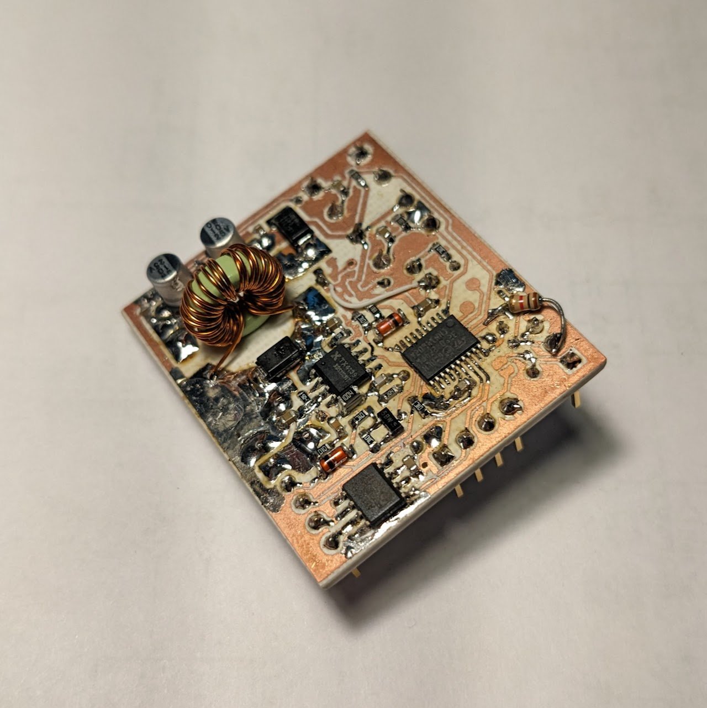
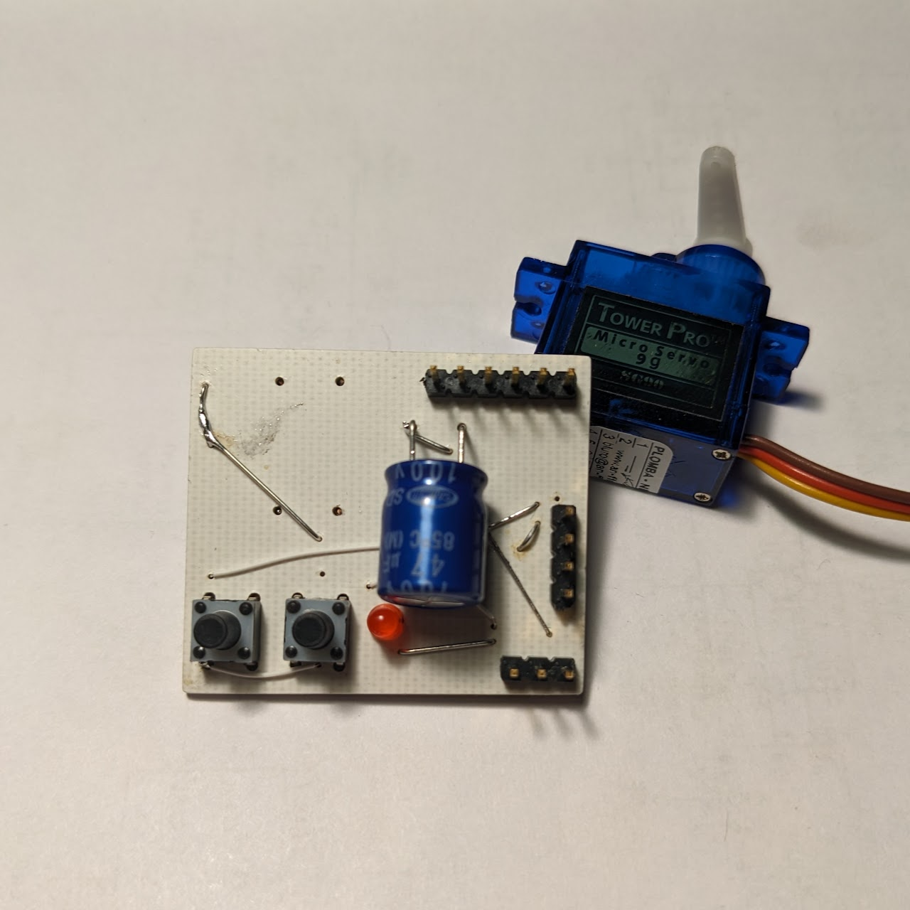
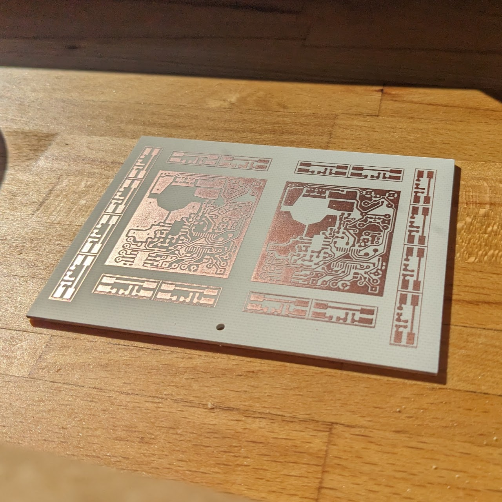
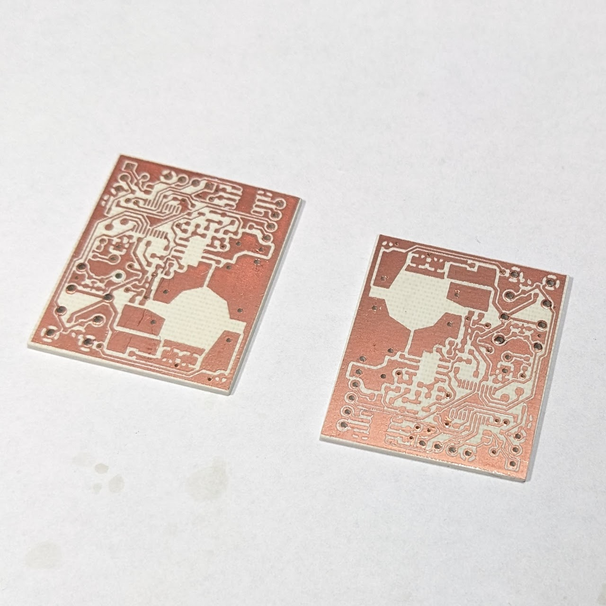
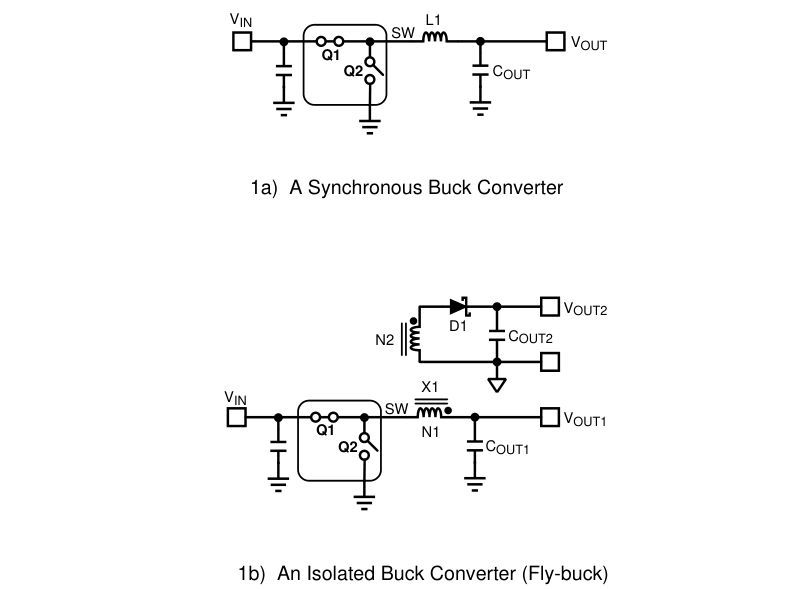
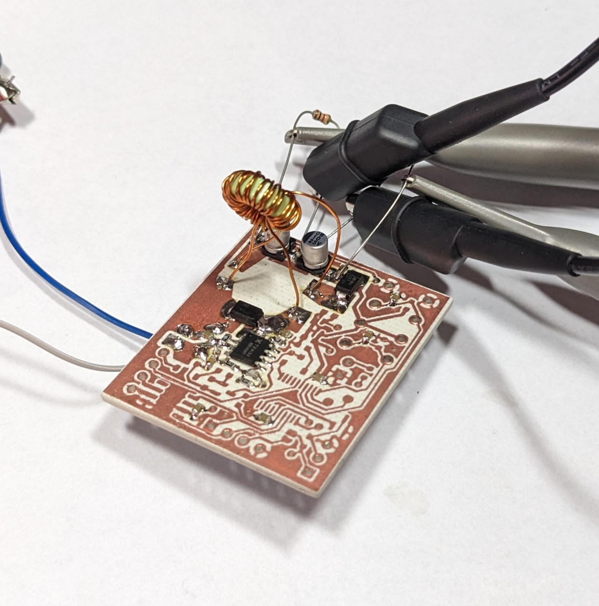
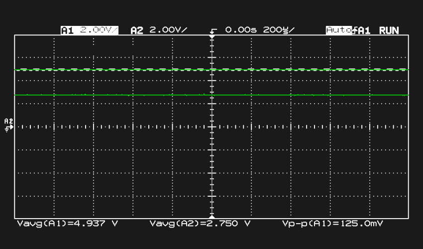
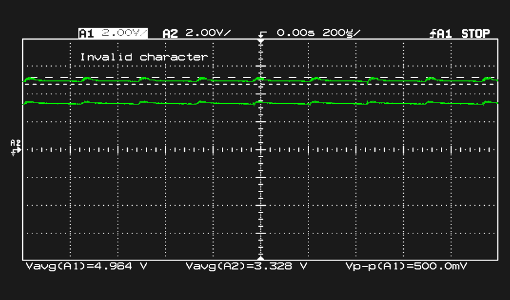

# Servo control board
A board for my electric scooter that controls one servo and communicates via CAN-bus. It is powered from a 52V li-po battery.
 

I etched the PCB on a CEM3 base laminate using photosensitive paint.

## Power supply design
Because of the unusally high supply voltage, the board needed a switch-mode power supply.
I've decided to use [XDS TX4139](https://www.lcsc.com/product-detail/DC-DC-Converters_XDS-TX4139_C329266.html) as the SMPS controller because of it's low cost, simplicity and because I had some in storage.
Its main parameters are up to 70V input voltage and 200kHz switching frequency which allows the use of small inductors.

I needed two output voltages: 5V for the CAN controller and servo, and 3.3V for the microcontroller.
Inspired by a Texas Instruments appnote [AN-2292](https://www.ti.com/lit/an/snva674c/snva674c.pdf), I've decided to experiment a bit and design an "isolated" buck converter - TI calls it a "Fly-buck" converter.

I didn't really need to isolate the MCU in any way, but getting two voltages out of one power supply without the use of an additional linear regulator seemed quite nice.

This design isn't practical in any way - a linear regulator doesn't add much cost to the BOM and doesn't take much space, it requires you to wind your own transformers by hand etc, but it's a nice experiment.

### The inductor

In this SMPS design, the secondary voltage equals the primary voltage times the ratio of the number of turns of each winding on the transformer.
I used a small toroidal core and copper transformer wire for the inductor.
To get 3.3V from 5V, I needed the secondary winding to have (3.3 / 5) = 0.66 times the turns as the primary winding.

I made 12 turns on the core for the primary winding and 8 turns for the secondary winding.

The TX4139 datasheet contains an equation for calculating the inductor's inductance, which for my use case suggests a ~45uH inductor.
It also recommends the inductor's resistance to be below 50mOhm.

I measured my inductor's inductance to be about 730nH for the primary and 320nH for the secondary winding, which equals to about 60 times less than recommended - I decided to try it out either way.

### Testing the power supply

After plugging the circuit to a power supply, the 5V rail came to life instantly - nicely staying at around 5.2V at different input voltages.
The secondary rail didn't respond at all - stayed at 0V at all times.

After some debugging I realised that the secondary rail won't come up unless the SMPS is actually pulsing the transformer - 
only after connecting a 1kOhm load on the primary power rail and increasing the input voltage, the secondary power rail's capacitors started charging up to 3.5V.

### Trimming the voltage
5.2V and 3.5V weren't exactly what i wanted though - I needed to lower the voltage a bit.
I changed R15 from a 56k resistor to a 68k resistor with two 1M resistors in parallel, which resulted in a ~59.8k resistance.
After that, the power rails stayed nicely at 4.96V and 3.32V:

12V input voltage:

40V input voltage:

At some voltages the circuit showed a ripple voltage of up to 500mV - the power rails could use some more filtering, but at voltages over 40V the ripple seemed to only get smaller.

## Issues
*These issues are also noted on the schematic in text, but aren't corrected on the PCB:*
 - Because the 3.3V power rail is entirely dependent on the SMPS running, the board can't be powered directly from USB, which is a bit inconvenient while programming.
 - On the STM32F042xx pins PA11 and PA12 are responsible for both CANbus and USB, but a USB cable and a CAN controller can't be connected both at once. This is an error on the PCB - I needed to cut the traces and solder wires with jumpers so that I can switch between USB and CAN by connecting or disconnecting them.
 - The servo MOSFET couldn't shut down fully for some reason and couldn't drive the servo. I realised that my 9g servo can be easily controlled with a 3.3V waveform - I desoldered the MOSFET and connected a 1kOhm resistor directly between the MCU pin and the servo control pin.
 - Because I was lazy and didn't want to etch a two-sided PCB, the front of the PCB is rather ugly :3
 - The 10k resistor on the LED is rather excessive and dims the LED a lot, 1k or less should be enough
 - Because the enable sense circuit is calculated for voltages near 50V the whole board only starts responding over 15V, which is again rather inconvenient while programming.
 - The CAN bus controller could use more protection - inductors and TVS diodes on CANH and CANL wouldn't hurt.

## Firmware
Rust has good support for the STM32F0 MCU series, so I decided to use it.
The firmware lives in the firmware/ folder. 
Right now it's only moving the servo back and forth, but will be extended in the future.

## Footer
If you have any questions or remarks, feel free to reach out to me, either on my twitter or e-mail: 

Twitter: [https://twitter.com/\_skelebot](https://twitter.com/\_skelebot)

E-mail: [antonisimka.8@gmail.com](mailto:antonisimka.8@gmail.com?subject=Servo_PCB)

Special thanks to [Arya](https://twitter.com/FairywrenTech) for convincing me to do a write-up on the board!
